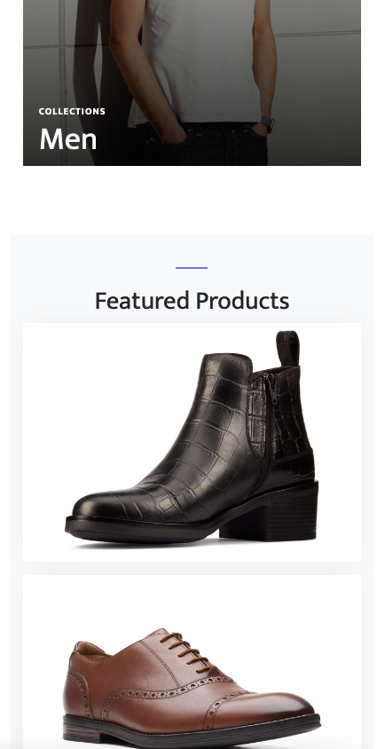
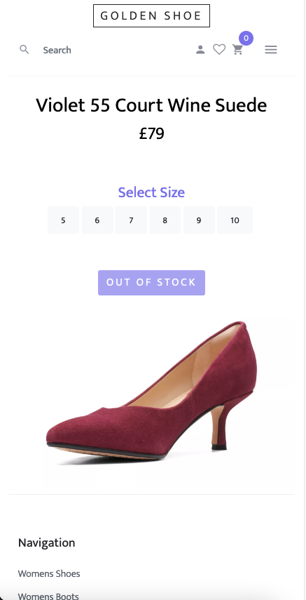

# Ecommerce Demo Project

The aim of the project is to demonstrate my ability to develop a Spring Boot application programming interface (API) with create/read/update/delete (CRUD) functionality with an Angular framework frontend and mySQL database. Postman can be used to utilise CRUD functionality. All products in the database are displayed on the homepage, clicking a product navigates to the product page, products can be added to the basket up to the stock limit.

Homepage             |  Product Page
:-------------------------:|:-------------------------:
 |  

## Usage
* Create a schema in mySQL called "spring-boot-angular-alan"
* Open terminal/shell in the root folder and input the following to start the backend then frontend:    

&emsp; `java -jar target/spring-boot-angular-1.0.jar`

&emsp; `cd src/main/js/ecommerce && npm start`
* View the page at http://localhost:4200/

### Http Requests
Http request can be made, for example using Postman, as follows:

#### Create Product:

POST: http://localhost:8080/api/products/create-product

{ "name": "name", "price" : 1, "pictureUrl": "url", "stock": 1 }

#### Delete Product:

DELETE: http://localhost:8080/api/products/delete-product-by-id/1

#### Read All Products:

GET: http://localhost:8080/api/products/

#### Read By ID:

GET: http://localhost:8080/api/products/readById/1

#### Update By ID:

PUT: http://localhost:8080/api/products/update-product-by-id/1
{ "name": "name", "price" : 1, "pictureUrl": "url", "stock": 1 }

Below are screenshots of Postman and MySQL to demonstrate CRUD functionality.

### Backend Testing Coverage Report

### Authors and Acknowledgment
Developed by Alan Kerby with some use of an [Angular template](https://www.baeldung.com/spring-angular-ecommerce) and a [Bootstrap template](https://themewagon.com/themes/free-bootstrap-4-html5-ecommerece-website-template-shoppers/)

