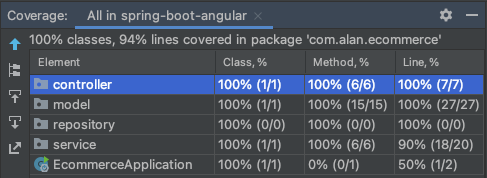

## Spring Boot Angular

This module contains articles about Spring Boot with Angular

### Relevant Articles:

- [Building a Web Application with Spring Boot and Angular](https://www.baeldung.com/spring-boot-angular-web)
- [A Simple E-Commerce Implementation with Spring](https://www.baeldung.com/spring-angular-ecommerce)

### Starting Frontend in Terminal
>>cd /Users/alk/golden-shoe-projects/spring-boot-angular-alan/src/main/js/ecommerce
>>npm start
> 
# Ecommerce Demo Project
## What is the project?

The aim of the project is to demonstrate my ability to develop a Spring Boot application programming interface (API) with create/read/update/delete (CRUD) functionality with an Angular framework frontend and mySQL database. Postman can be used to utilise CRUD functionality. All products in the database are displayed on the homepage, clicking a product navigates to the product page, products can be added to the basket up to the stock limit.

Usage
Below are screenshots of Postman and MySQL to demonstrate CRUD functionality.

### Testing Coverage Report

### Authors and Acknowledgment
Developed by Alan Kerby with some use of an [Angular template](https://www.baeldung.com/spring-angular-ecommerce) and a [Bootstrap template](https://themewagon.com/themes/free-bootstrap-4-html5-ecommerece-website-template-shoppers/)

